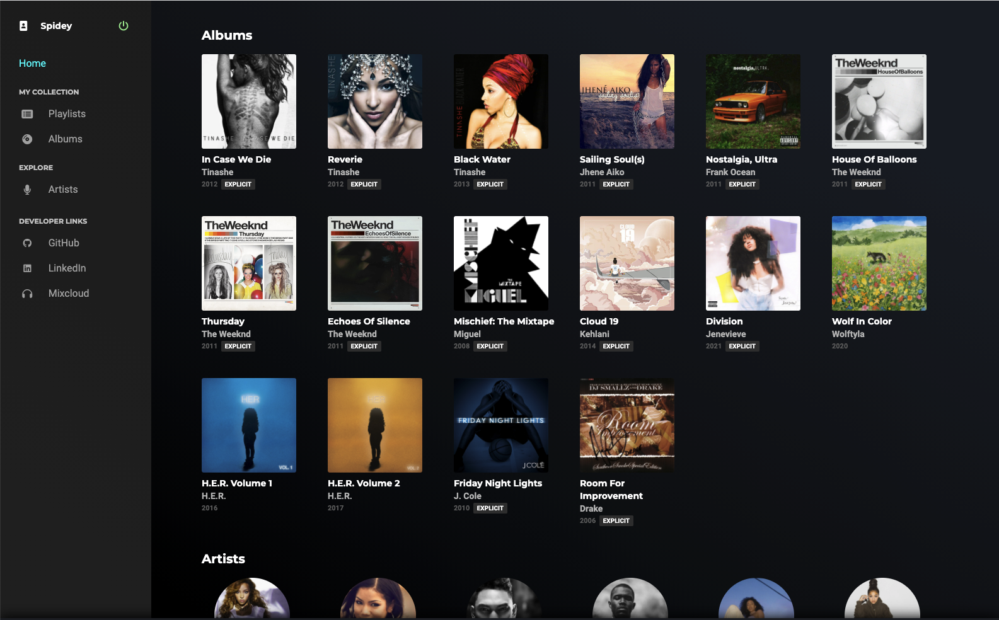

[View Ripple](https://ripple-jz.herokuapp.com)

# Ripple

## About

Ripple sets out to emulate popular music streaming sites such as Tidal and Spotify with the added caveat of having a library composed of the early works of popular artists and new up and coming artists as well. Users can create their own playlists and like albums and tracks.

## Image Walkthrough



Once logged in, users may explore a collection of albums and artists to discover new songs.


Selecting albums will display all the tracks and allow the ability to favorite the album or the individual track. Tracks can also be added to the user's playlists.


Users can create new playlists and add and subtract to them as they like while browsing the site.

## Feature Descriptions
1. While browsing through album pages, users are presented with '+' buttons on each track that allow for a modal to appear where users can select which playlist to add on to.
2. While viewing selected playlists, users can easily remove tracks by clicking on the '-' button associated with the track.
3. Users can click on corresponding 'heart' buttons to mark that album or track as a favorite. 
 
## Development Information

### Technologies Used

BackEnd | Frontend
---|:--
Ruby on Rails | React
PostgreSQL | Redux
AWS S3 | JavaScript ES6
jbuilder | 
### Notable Code Snippets

```javascript
handleLike() {
  if (!!likedAlbums[albumId]) {
    deleteAlbumLike(likedAlbums[albumId]);
  } else {
    postAlbumLike({userId: currentUserId, albumId: albumId});
  }
}
```

* By storing the key-value pair of a user's liked track's ID with the specific track ID, I was able to make the boolean check for likes much more efficient on view.

### Future Additions

* Add an audio player with playlist features
* Display pages for tracks, and favorited tracks
